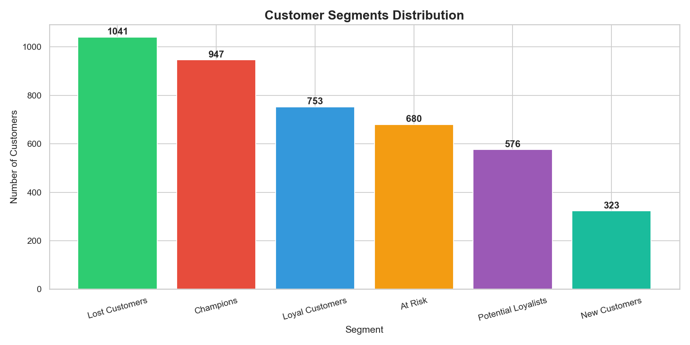
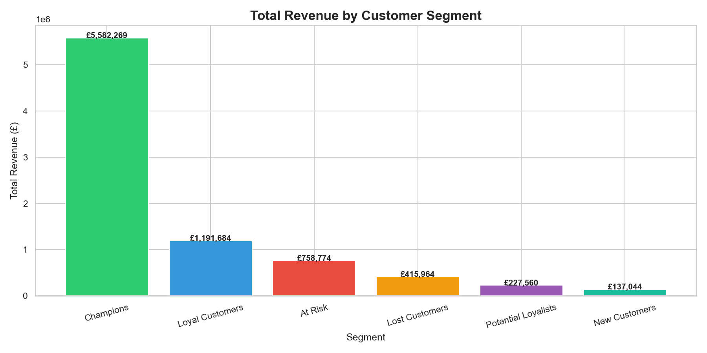
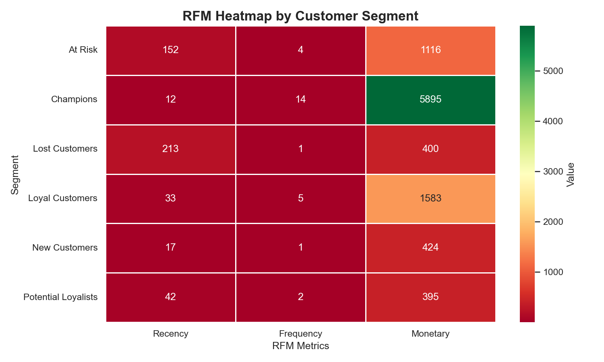
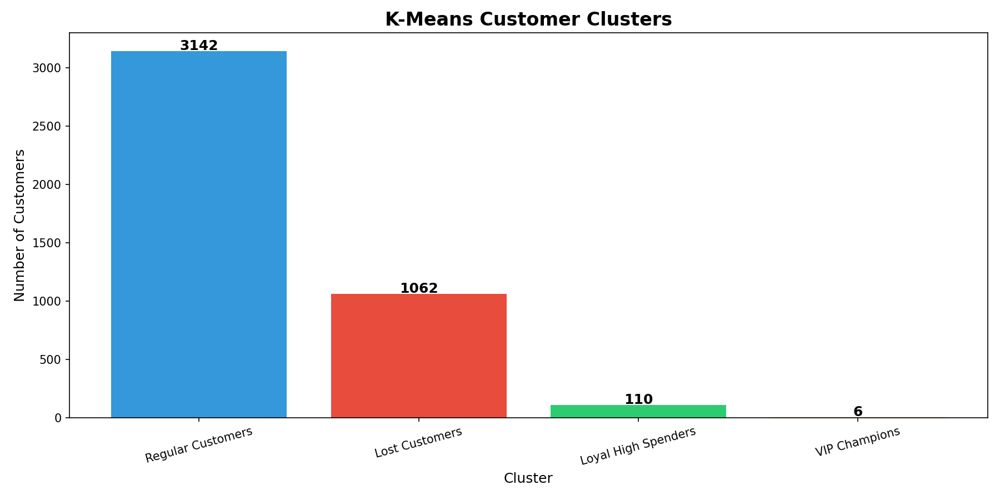

# Customer Segmentation Analysis
## Project Overview
End-to-end customer segmentation analysis using RFM Analysis 
and K-Means Clustering on 500,000+ real e-commerce transactions.

## Business Problem
A UK online retailer needed to understand their customer base 
to create targeted marketing strategies and increase revenue.

##  Key Findings
- Analyzed **541,909 transactions** from 4,320 unique customers
- Identified **6 RFM segments** based on buying behavior
- Applied **K-Means clustering** to find 4 natural customer groups
- Found **6 VIP customers** generating avg £182,182 each!
- **1,062 lost customers** who need win-back campaigns

## Visualizations

### Customer Segments Distribution


### Revenue by Segment


### RFM Heatmap


### K-Means Clusters


##  Business Recommendations
| Segment | Action |
|---------|--------|
| VIP Champions | Assign personal account manager |
| Loyal High Spenders | Exclusive loyalty rewards |
| Regular Customers | Upsell campaigns |
| Lost Customers | Win-back email with 20% discount |

## Tools Used
- Python, Pandas, NumPy
- Scikit-learn (K-Means)
- Matplotlib, Seaborn
- Jupyter Notebook

## Project Structure
```
customer_segmentation/
├── data/
│   ├── raw/          # Original dataset
│   └── processed/    # Cleaned & analyzed data
├── notebooks/        # Analysis notebooks
├── outputs/figures/  # All visualizations
└── README.md
```

## How to Run
1. Clone this repository
2. Install requirements: `pip install -r requirements.txt`
3. Run notebooks in order (01 → 05)


## About This Project
This is a personal project I built to demonstrate real-world 
data analysis skills. The entire pipeline — from raw data 
to business insights — was built from scratch using Python.